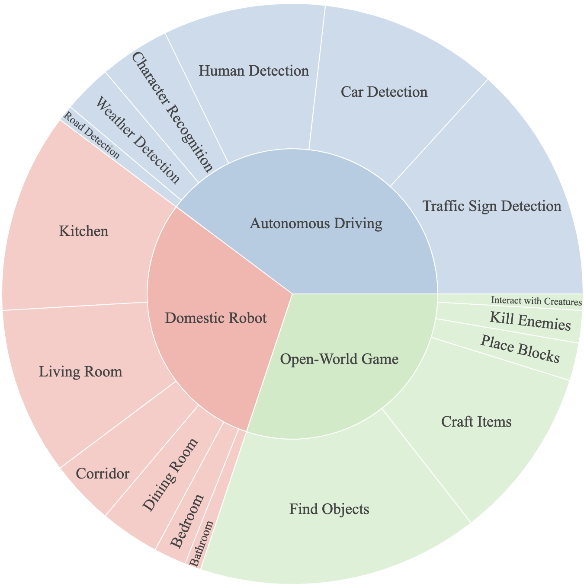
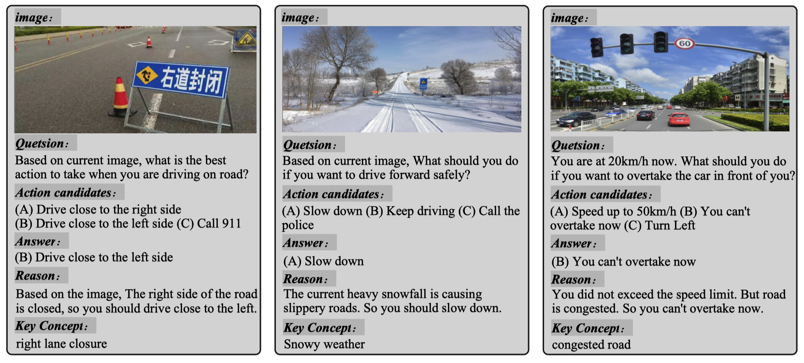
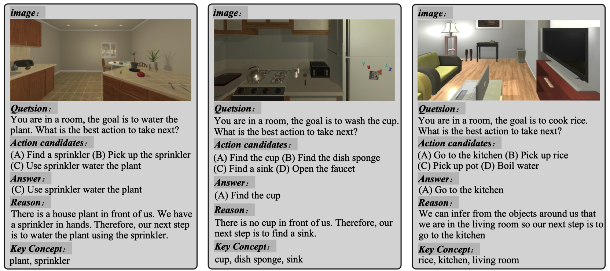
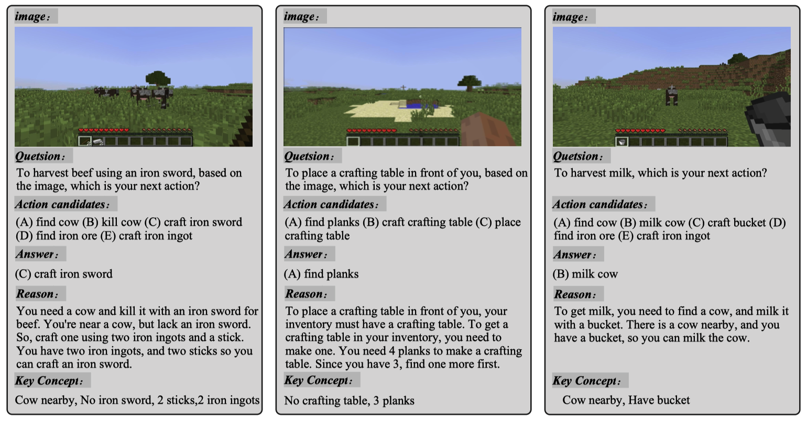

<h1 align="center">PCA-EVAL</h1>

<p align="center">

<a href="https://pca-eval.github.io/">

</a>

<a href="https://arxiv.org/abs/2310.02071">

</a>
</p>

*PCA-EVAL is an innovative benchmark for evaluating multi-domain embodied decision-making, specifically focusing on the performance in perception, cognition, and action. It is proposed in paper "[Towards End-to-End Embodied Decision Making via Multi-modal Large Language Model: Explorations with GPT4-Vision and Beyond](https://arxiv.org/abs/2310.02071)".*


## Benchmark

<div align=center>

      
Domain and required ability distribution of PCA-EVAL.
</div>

### Examples

- Traffic Domain

<div align=center>

</div>


- Domestic Robot Domain

<div align=center>

</div>


- Game Domain

<div align=center>

</div>

## Run Evaluation


```bash
git clone https://github.com/pkunlp-icler/PCA-EVAL.git
cd PCA-EVAL
```


### End2End Method

In the End2End method, the prompt utilized for each instance, along with its corresponding image name, is provided in JSON format within the data directory specific to each domain. For example:

```bash
pca-eval/data/v1.0/Autonomous Driving/end2end_prompts.json
pca-eval/data/v1.0/Domestic Robot/end2end_prompts.json
pca-eval/data/v1.0/Open-World Game/end2end_prompts.json
```

You can seamlessly pass both the image and the prompt to your multimodal model to obtain results.

The output for each instance should be saved in json file, in the format of
```json
[
    {"index":0,"model_output":"xxxxx"},
    {"index":1,"model_output":"xxxxx"}, 
]
```


### HOLMES Method

For HOLMES method using LLM, we provide jupyter notebooks for OPENAI model tested in our paper. By changing the openai key and data path, you could reproduce the results easily.

```bash
pca-eval/evaluation/HOLMES_Autonomous_Driving.ipynb
pca-eval/evaluation/HOLMES_Domestic_Robot.ipynb
pca-eval/evaluation/HOLMES_Game.ipynb
```


The output for each instance should be saved in json file, in the format of
```json
[
    {"index":0,"model_output":"xxxxx"},
    {"index":1,"model_output":"xxxxx"},
]
```

### Automatic Scoring

We utilize the semantic parsing ability of powerful LLM like ChatGPT to conduct automatic scoring for perception, cognition and action scores.
(by default, we use gpt-4 for evaluation, we find chatgpt-eval would lead to a much higher result than the real scores, gpt4-eval could get results close to human ratings at 90%+ accuracy)
```bash
python pca-eval/pca_auto_scoring.py \ 
    --meta_data  pca-eval/data/v1.0/Open-World Game/meta_data.json \  # path to the meta data
    --model_output chatgpt_output.json \  # model output file in json format
    --openai_key sk-xxxxxxxxxx \  # your openai key
    --output_path  chatgpt_result.json \  # path to save the result
```


## Citation
```bib
@article{chen2023endtoend,
      title={Towards End-to-End Embodied Decision Making via Multi-modal Large Language Model: Explorations with GPT4-Vision and Beyond}, 
      author={Liang Chen and Yichi Zhang and Shuhuai Ren and Haozhe Zhao and Zefan Cai and Yuchi Wang and Tianyu Liu and Baobao Chang},
      year={2023},
      journal={ArXiv},
}
```


