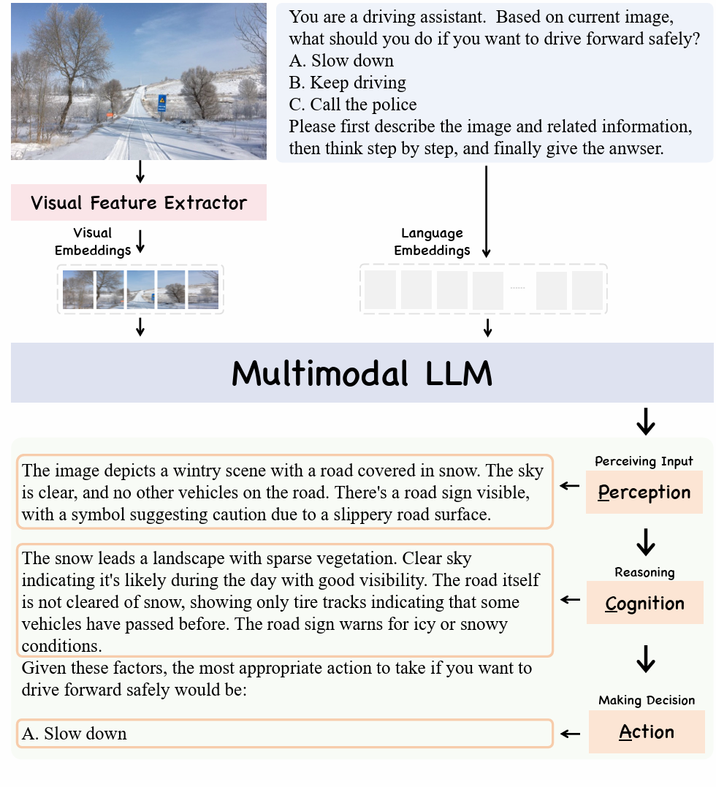

<h1 align="center">PCA-Bench</h1>

<p align="center">

<a href="https://pca-eval.github.io/">

</a>

<a href="https://arxiv.org/abs/2310.02071">


<a href="https://huggingface.co/datasets/PCA-Bench/PCA-Bench-V1">

</a>
</p>


*PCA-Bench is an innovative benchmark for evaluating and locating errors in Multimodal LLMs when conducting embodied decision making tasks, specifically focusing on perception, cognition, and action.*

<div align=center>

</div>


## Release
- [2024.02.15] PCA-Bench-V1 is released. We release the open and closed track data in [huggingface](https://huggingface.co/datasets/PCA-Bench/PCA-Bench-V1). We also set an online [leaderboard ](https://docs.qq.com/sheet/DVUd4WUpGRHRqUnNV) accepting users' submission.
- [2023.12.15] [PCA-EVAL](https://arxiv.org/abs/2310.02071) is accepted to Foundation Model for Decision Making Workshop @NeurIPS 2023. PCA-Evaluation tool is released in github.

## Leaderboard
[Leaderboard with Full Metrics](https://docs.qq.com/sheet/DVUd4WUpGRHRqUnNV)


## Submit Results

📢 For close track evaluaiton and PCA-Evaluation, please follow [this file](https://github.com/pkunlp-icler/PCA-EVAL/blob/main/pca-eval/results/chatgpt_holmes_outputs/Autonomous%20Driving.json) to organize your model output. Submit **Six JSON files** from different domains and different tracks, along with your **model name** and **organization** to us via [email](mailto:leo.liang.chen@stu.pku.edu.cn). Ensure you use the dataset's provided prompt as the default input for fair comparison.

We will send the PCA-Eval results of your model to you and update the leaderboard.

We provide sample code to get the six json files. User only needs to add your model inference code:
```python
# Sample code for PCA-Eval
from datasets import load_dataset
from tqdm import tqdm
import json
import os

def YOUR_INFERENCE_CODE(prompt,image):
    """Simple single round multimodal conversation call.
    """
    response = YOUR_MODEL.inference(prompt,image)
    return response

output_path = "./Results-DIR-PATH/"
os.mkdir(output_path)

dataset_ad = load_dataset("PCA-Bench/PCA-Bench-V1","Autonomous Driving")
dataset_dr = load_dataset("PCA-Bench/PCA-Bench-V1","Domestic Robot")
dataset_og = load_dataset("PCA-Bench/PCA-Bench-V1","Open-World Game")

test_dataset_dict = {"Autonomous-Driving":dataset_ad,"Domestic-Robot":dataset_dr,"Open-World-Game":dataset_og}
test_split = ["test_closed","test_open"]
test_domain = list(test_dataset_dict.keys())

for domain in test_domain:
  for split in test_split:
    print("testing on %s:%s"%(domain,split))

    prediction_results = []
    output_filename = output_path+"%s-%s.json"%(domain,split)
    prompts = test_dataset_dict[domain][split]['question_prompt']
    images = test_dataset_dict[domain][split]['image']

    for prompt_id in tqdm(range(len(prompts))):
        user_inputs = prompts[prompt_id] # do not change the prompts for fair comparison
        index = prompt_id
        image = images[prompt_id]

        outputs = YOUR_INFERENCE_CODE(user_inputs,image)

        prediction_results.append({
            'prompt': user_inputs,
            'model_output': outputs,
            'index': index,
        })

    with open(output_filename, 'w') as f:
        json.dump(prediction_results, f, indent=4)

# submit the 6 json files in the output_path to our email
```

You could also simply compute the multiple-choice accuracy locally as a comparison metric in your own experiments. However, in the online leaderboard, we only consider the average action score and Genuine PCA score when ranking models.


## Run PCA Evaluation Locally

The output for each instance should be saved in json file, in the format of
```json
[
    {"index":0,"model_output":"xxxxx"},
    {"index":1,"model_output":"xxxxx"}, 
]
```

A meta data file consisting of groundtruth concepts, reason and action is needed to conduct PCA-Eval.

Open test's meta data are provided in the repo under PCA-Bench directory.

```bash
python ./pca-eval/evaluation/pca_auto_scoring.py \ 
    --meta_data  ./PCA-Bench/Autonomous-Driving-test_open-meta.json \  # path to the meta data
    --model_output model_output.json \  # model output file in json format
    --openai_key sk-xxxxxxxxxx \  # your openai key
    --output_path  pca-eval-result.json \  # path to save the result
```

**Evaluation Rule: To make fair evaluation and comparison among different models, make sure you use the same LLM evaluation model as ours (GPT4-0125) for all the models you want to evaluate.**


### HOLMES Method

For HOLMES method using LLM, we provide jupyter notebooks(under pca-eval/evaluation) for OPENAI model tested in our paper. By changing the openai key and data path, you could reproduce the results easily.

```bash
pca-eval/evaluation/HOLMES_Autonomous_Driving.ipynb
pca-eval/evaluation/HOLMES_Domestic_Robot.ipynb
pca-eval/evaluation/HOLMES_Game.ipynb
```

The output for each instance should be saved in json file, whihh can be evaluated using the pca-eval tool.
```json
[
    {"index":0,"model_output":"xxxxx"},
    {"index":1,"model_output":"xxxxx"},
]
```


## Benchmark Overview

<div align=center>

      
Domain and required ability distribution of PCA-EVAL.
</div>

### Examples

- Traffic Domain

<div align=center>

</div>


- Domestic Robot Domain

<div align=center>

</div>


- Game Domain

<div align=center>

</div>

## Citation
```bib
@article{chen2023endtoend,
      title={Towards End-to-End Embodied Decision Making via Multi-modal Large Language Model: Explorations with GPT4-Vision and Beyond}, 
      author={Liang Chen and Yichi Zhang and Shuhuai Ren and Haozhe Zhao and Zefan Cai and Yuchi Wang and Peiyi Wang and Tianyu Liu and Baobao Chang},
      year={2023},
      journal={ArXiv},
}
```


